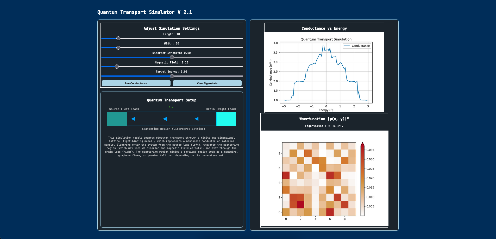

# Quantum Transport Simulations Repository

This repository contains an interactive Python-based framework and web application for simulating quantum electron transport in nanoscale systems, featuring real-time conductance visualization and wavefunction inspection using tight-binding models and the Kwant package.

[Note: This application is now live! Please try it out at this link!](http://silalabs.io/qtransport/)




## Important Mathematical Background and Results
A detailed summary of this project’s methodology and results — including conductance behavior, wavefunction localization, and simulation visuals — is available in the accompanying research report:

[Read the full report (PDF)](https://senurir.github.io/pdfs/A_Python_Based_Simulation_Framework_for_Visualizing_Nanoscale_Quantum_Transport.pdf)

This repository serves as a foundation for exploring more complex quantum transport phenomena. Contributions and extensions are welcome!

## Importance & Applications
This framework enables users to:

- Explore quantum transport phenomena in mesoscopic systems

- Investigate how disorder and magnetic fields affect electron conduction

- Analyze wavefunction localization and its impact on transmission

- Understand Landauer-Büttiker formalism in a visual and interactive way

- Study topological effects like Landau levels and edge states

It is particularly useful for:

- Research prototyping, especially when analyzing tight-binding models and scattering behavior

- Scientific communication, as it provides intuitive visualizations of abstract quantum processes

- Educational purposes, including undergraduate and graduate teaching in quantum mechanics or condensed matter

## Technologies Used
- Python 3.10 – Core simulation logic and backend infrastructure

- Kwant – Quantum transport modeling using tight-binding Hamiltonians

- NumPy & SciPy – Linear algebra, numerical routines, and eigensolver utilities

- Matplotlib – Plotting conductance and wavefunction heatmaps

- FastAPI – Backend API for real-time simulations

- Uvicorn – ASGI server for running the FastAPI backend

- Pydantic – Data model validation for simulation inputs

- React – Frontend framework for user interface and interactivity

- Vite – Fast development server and bundler for React

- (Optional) Tailwind CSS – (used in earlier UI versions for styling)


## Installation for Running Locally

### Using Conda (Recommended)
Create a new environment and install dependencies:
```bash
conda env create -f environment.yml
conda activate quantum-transport-simulations
```

### Using pip
Alternatively, install dependencies via pip:
```bash
pip install -r requirements.txt
```

## Core Experiment Scripts Included

1. **Quantum Conductance in 1D Chain** (`core_experiments/quantum_conductance_1d.py`)
   - Simulates electron transport through a simple 1D tight-binding model.
   - Shows conductance behavior based on the Landauer formula.

2. **Anderson Localization in 1D** (`core_experiments/anderson_localization_1d.py`)
   - Introduces disorder into the 1D model to observe localization effects.

3. **Quantum Hall Effect in 2D (Peierls Phase Implementation)** (`core_experiments/qhe_2d_peierls.py`)
   - Models a 2D tight-binding system under a perpendicular magnetic field.
   - Implements Peierls phase factor to simulate Landau levels.

4. **Disorder Effects in the Quantum Hall System** (`core_experiments/disordered_qhe_2d.py`)
   - Adds disorder to the 2D Quantum Hall system to analyze localization and conductance breakdown.

## Running the Core Individual Experiments Locally
Each script can be executed independently. For example, to run the 1D quantum conductance simulation:
```bash
python core_experiments/quantum_conductance_1d.py
```
Results will be displayed graphically using Matplotlib.