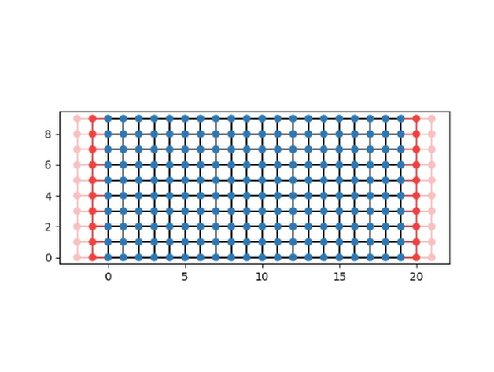

# Quantum Transport Simulations Repository

This repository contains Python scripts for simulating quantum transport phenomena using the Kwant package.

## Experiments Included

1. **Quantum Conductance in 1D Chain** (`quantum_conductance_1d.py`)
   - Simulates electron transport through a simple 1D tight-binding model.
   - Shows conductance behavior based on the Landauer formula.

2. **Anderson Localization in 1D** (`anderson_localization_1d.py`)
   - Introduces disorder into the 1D model to observe localization effects.

3. **Quantum Hall Effect in 2D (Peierls Phase Implementation)** (`qhe_2d_peierls.py`)
   - Models a 2D tight-binding system under a perpendicular magnetic field.
   - Implements Peierls phase factor to simulate Landau levels.

4. **Disorder Effects in the Quantum Hall System** (`disordered_qhe_2d.py`)
   - Adds disorder to the 2D Quantum Hall system to analyze localization and conductance breakdown.

## Important Mathematical Background

### **1D Tight-Binding Model Hamiltonian**
The Hamiltonian for a 1D tight-binding system is given by:

\[
H = \sum_{i} \varepsilon_i c_i^\dagger c_i + \sum_{\langle i,j \rangle} t_{ij} c_i^\dagger c_j
\]

where:
- \( \varepsilon_i \) is the on-site energy.
- \( c_i^\dagger \), \( c_i \) are the creation and annihilation operators.
- \( t_{ij} \) is the hopping amplitude between sites \( i \) and \( j \).

### **Landauer Formula for Conductance**
The conductance in a quantum transport system is given by:

\[
G = \frac{2e^2}{h} T(E)
\]

where \( T(E) \) is the transmission probability at energy \( E \).

### **2D Tight-Binding Model with Magnetic Field (Quantum Hall Effect)**
For a 2D lattice in a perpendicular magnetic field, the Hamiltonian is modified as:

\[
H = \sum_{x,y} \varepsilon_{x,y} c_{x,y}^\dagger c_{x,y} + \sum_{\langle x',y' \rangle} t_{x',y'} e^{i\phi_{x',y'}} c_{x',y'}^\dagger c_{x,y}
\]

where the Peierls phase \( \phi_{x',y'} \) is introduced to simulate the effect of the magnetic field.

### **Anderson Localization**
When disorder is introduced into the system, the electron wavefunctions become localized, leading to a suppression of conductance. This phenomenon is modeled by adding random fluctuations to the on-site energy \( \varepsilon_i \).

## Results

### 1D Chain


### 2D Lattice


### 1D Quantum Conductance Simulation


### Anderson Localization in 1D


### Quantum Hall Effect in 2D


### Disorder in Quantum Hall Effect


## Installation

### Using Conda (Recommended)
Create a new environment and install dependencies:
```bash
conda env create -f environment.yml
conda activate quantum-transport-simulations
```

### Using pip
Alternatively, install dependencies via pip:
```bash
pip install -r requirements.txt
```

## Running the Experiments
Each script can be executed independently. For example, to run the 1D quantum conductance simulation:
```bash
python quantum_conductance_1d.py
```
Results will be displayed graphically using Matplotlib.

## Technologies Used
- **Python 3.10**
- **Kwant** - Quantum transport simulations
- **NumPy** - Numerical computations
- **Matplotlib** - Data visualization
- **SciPy** - Scientific computing

## Importance & Applications
These simulations are crucial for understanding:
- **Quantum transport in nanowires and mesoscopic systems**
- **Effects of disorder and localization in materials**
- **Quantum Hall physics and topological states**

This repository serves as a foundation for exploring more complex quantum transport phenomena. Contributions and extensions are welcome!

---

name: quantum-transport-simulations
channels:
  - conda-forge
  - defaults
dependencies:
  - python=3.10
  - kwant
  - numpy
  - matplotlib
  - scipy
